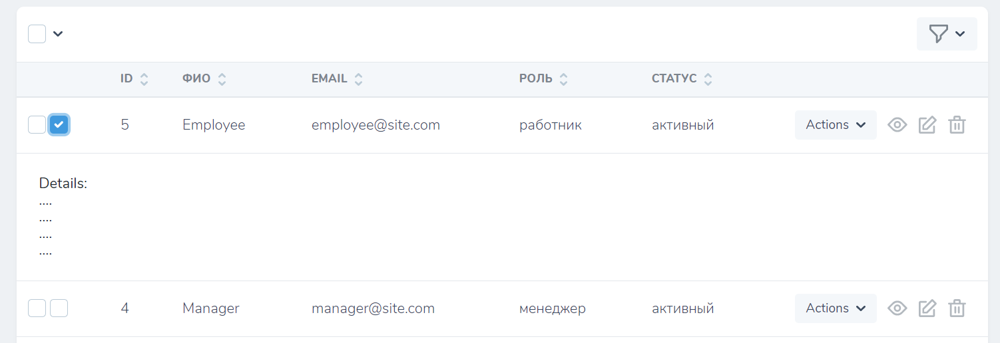

# TableRowWithDetail
Laravel Nova tool package TableRowWithDetail (VueJS)



# Installation

You can install the package via composer:

```
composer require cbmaster-net/table-row-with-detail
```

# Usage

Just install this package and every row in your tables will automatically become clickable for row details.


## License

The MIT License